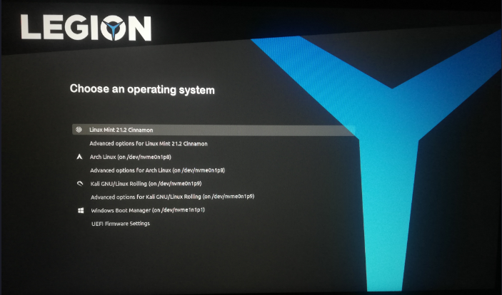

## Preview
---


## Installing
---
### Ubuntu
copy the extracted theme to `/boot/grub/themes`
```
sudo cp CyberRe\ 1.0.0/CyberRe /boot/grub/themes/ -r

sudo nano /etc/default/grub
```

At the bottom of the file, paste the following, updating the path to the theme.txt file
`GRUB_THEME=/boot/grub/themes/Legion-grub-theme/theme.txt`

Press CTRL+O, Enter, CTRL+X to write the changes

Update grub
```
sudo update-grub
```
If everything is setup correctly, a line that reads Found theme: `/boot/grub/themes/Legion-grub-theme/theme.txt` should show in the update-grub output

Reboot to see the new theme in action
```
sudo reboot
```
---
### Linux Mint
Easy way to install theme:
```
sudo nano /etc/default/grub.d/90_custom.cfg
```
add the lines:
```
GRUB_TIMEOUT="5"
GRUB_TIMEOUT_STYLE="menu"
```

```
apt install --reinstall -o Dpkg::Options::="--force-confmiss" grub2-theme-mint
```
Then replace theme folder in /boot/grub/themes
```
sudo open /boot/grub/themes
```
Update grub
```
sudo update-grub
```
Reboot
```
sudo reboot
```

 *You may also install it via Ubuntu way*
 
---
### Fedora
Download and Extract the theme. (make sure to look inside the folder if there are any other versions of the theme.

Open the Terminal and copy the file to `/boot/grub2/theme`, for example
```
sudo cp -r poly-light /boot/grub2/theme
```

  
Next after copying, you go into the grub config like so
```
sudo nano /etc/default/grub
```

  
Comment out the line **GRUB_TERMINAL_OUTPUT=console**, by putting a # infront of it, and make a new like with the following:
```
GRUB_THEME="/boot/grub2/theme/INSERT-THEME/theme.txt"
```
Change INSERT-THEME to whatever the name of the folder is, that you copied earlier. Then you can press CTRL+S and CTRL+X to exit the config.

  

Finally you type:
```
sudo grub2-mkconfig -o /etc/grub2-efi.cfg
```

When you've done this, you can reboot and see if the theme applied!
```
sudo reboot
```

---


## Removing the Theme

```
cd /boot/grub/themes/
```
```
ls
```
```
sudo rm Legion-grub-theme -r
```
```
sudo update-grub
```
```
reboot
```

